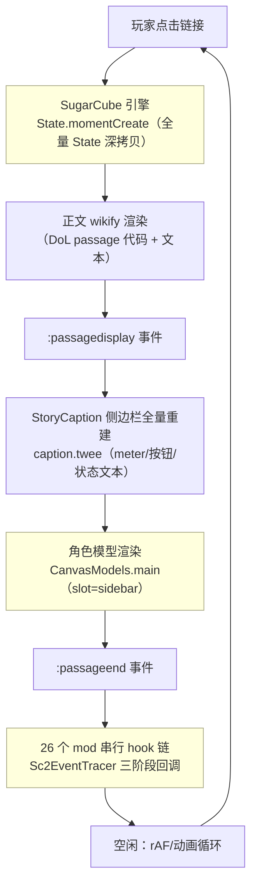
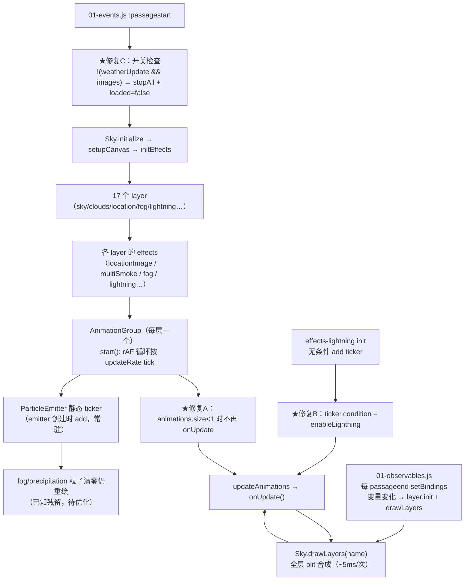
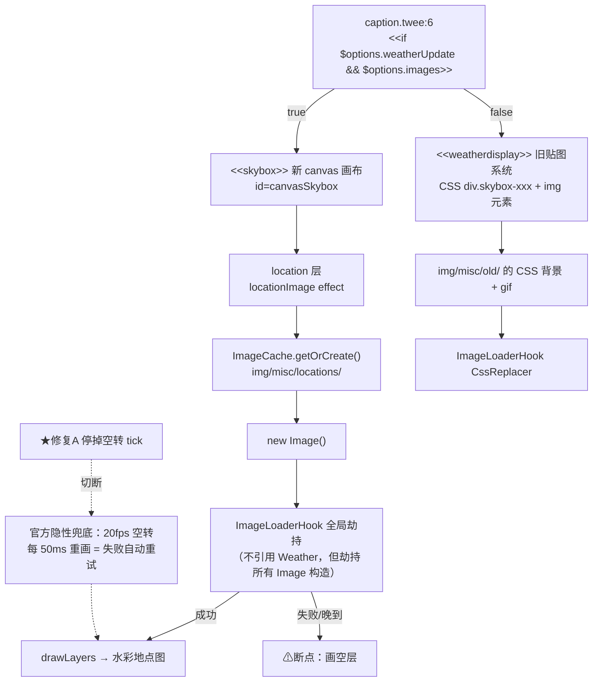
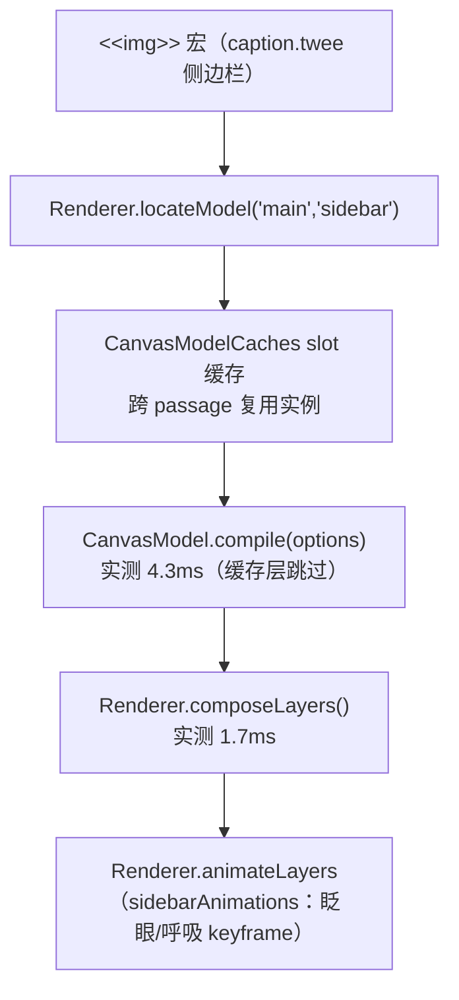
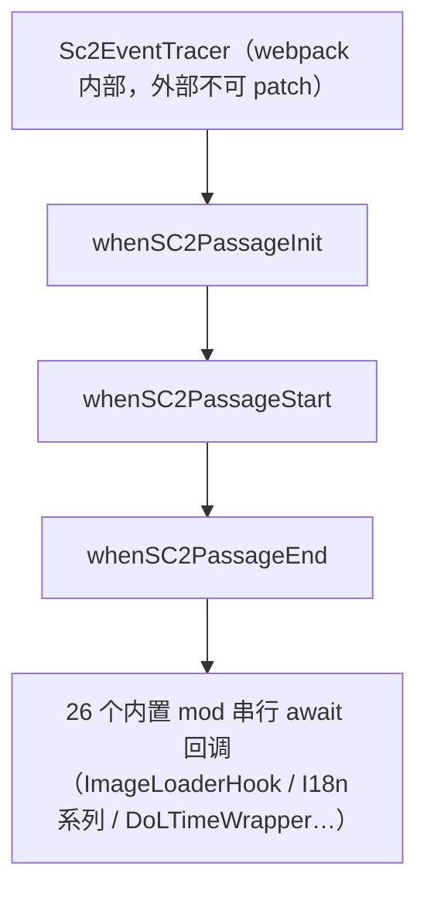
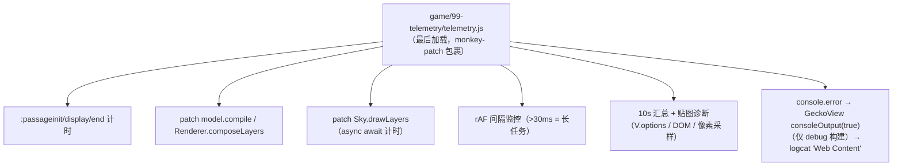
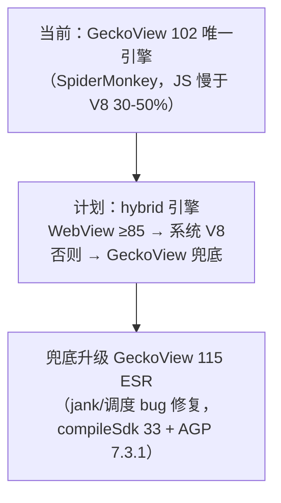

# DoL-Genesis-LTS 渲染与性能架构图谱

> 用途：性能优化与 bug 定位的导航图。每次上游合并或系统改动后同步更新。
> 图例：`★修复X` = 已落地的 LTS 修复；`⚠断点` = 已知问题/待验证假设。

## 1. 总览：passage 渲染全链路

**实测耗时（GeckoView 102 / 骁龙 855 / 真机遥测）**：

| 段 | 耗时 | 备注 |
|----|------|------|
| 正文渲染 | 45-82ms | DoL passage JS + wikify |
| 侧边栏+mod 链 | 61-104ms | 含 StoryCaption 重建 + 26 mod 回调 |
| 角色模型 compile | **4.3ms** | 缓存命中率高，非瓶颈（勿再优化） |
| 角色模型 compose | **1.7ms** | 同上 |
| 总计 | 114-172ms | "点一下顿一下"的来源 |

## 2. 天气画布系统（新 canvas 系统）

**关键文件**：
- `game/03-JavaScript/weather/03-canvas/01-src/00-classes/`——Sky/Layer/AnimationGroup/Animation/ParticleEmitter
- `game/03-JavaScript/weather/03-canvas/02-lib/01-layers/`——各层定义（layer-location/layer-lightning/layer-fog…）
- `game/03-JavaScript/weather/03-canvas/02-lib/00-effects/`——各 effect（effects-location/effects-lightning/effects-particles…）
- `game/03-JavaScript/weather/01-setup/weather-bindings.js`——observables 绑定表（含 location: V.location → location 层）

**已知残留（docs/weather-fix-2026-08-29.md）**：
1. 反射关闭但地点有反射图 → distortion 动画 10fps 白烧（disable 不 remove）
2. fog/precipitation 粒子清零后仍重绘（ParticleEmitter ticker 常驻）
3. ParticleEmitter re-init 泄漏（静态 #emittersByGroup 持有旧引用）

## 3. 贴图渲染双路径（⚠ 地点贴图消失调查中）

**⚠ 调查中（2026-08-29）**：地点贴图不显示。已确认的事实：① 诊断数据 `images=1 weatherUpdate=true canvasSkyboxInDom=true`，走新 canvas 路径；② location 层画布像素全透明；③ logcat 有 `ctx.reset is not a function` 报错（FF122+ 才有该 API）。未决：天气修复 A/B/C 与贴图显示的关系（修复前贴图状态待实测裁决）。当前动作：天气修复已整体回退，遥测诊断输出保留，待重新定位。

## 4. 角色模型渲染（已确认非瓶颈）

## 5. ModLoader 事件链（caption+chain 的大头，待拆）

**注**：遥测目前只能测整链耗时（61-104ms），mod 级拆分需要 ModLoader 日志（ModLoaderLog 导出）或按 mod 逐个禁用的 A/B 实验。

## 6. LTS 遥测层

**开关**：输出可见性由 `GeckoViewEngine.java` 的 `consoleOutput(true)` 控制（仅 debug 构建）。遥测代码常驻、开销 <0.1%。

## 7. 引擎层（待实装）

**依据**：Speedometer 移动端 Firefox 落后 Chrome；社区共识 hybrid（webdev-support 2024）；GeckoView jank bug 修复集中在 115-118。

## 8. 引擎 API 兼容性审计（GeckoView 102 = Firefox 102）

> 审计工具：`devTools/api-scan.py`（每次上游合并后重跑）。扫描范围：game/ + modules/ 共 230 文件。

| API | 调用次数 | FF 102 | 处理 |
|-----|---------|--------|------|
| `ctx.reset()` | 4 | 缺失（FF122+） | ✅ polyfill（`game/00-framework-tools/polyfills.js`） |
| `Math.clamp()` | 249 | 缺失（FF130+） | ✅ polyfill（同上） |
| `ctx.filter`（blur 等） | 6 | 无效（FF116+，静默） | ⚠ 静默降级：反射/发光无模糊，图仍在。不可 JS polyfill，等 116+ 内核自动恢复 |
| `window.print` | 33 | 无打印 UI | 📝 功能缺失，不崩 |

其余全绿：语法级（?. / ?? / ??= / #private / top-level await）与运行时（replaceAll / at() / structuredClone / ResizeObserver / clipboard / CSS color-mix / lch / :has 未使用）均无缺口。
